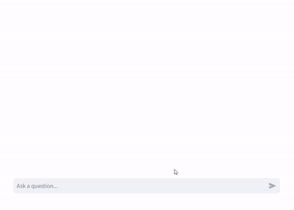
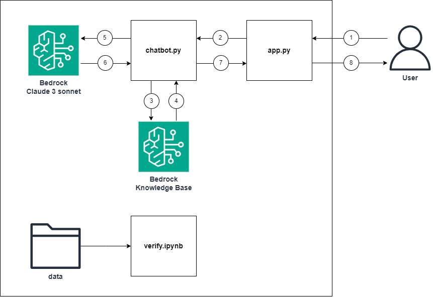
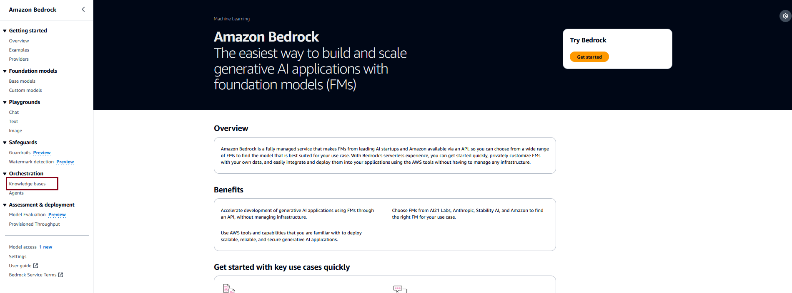
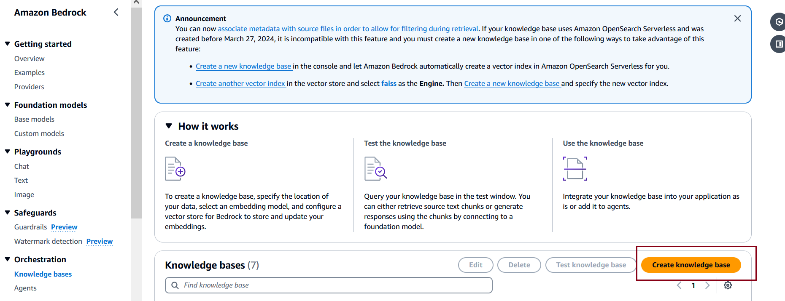
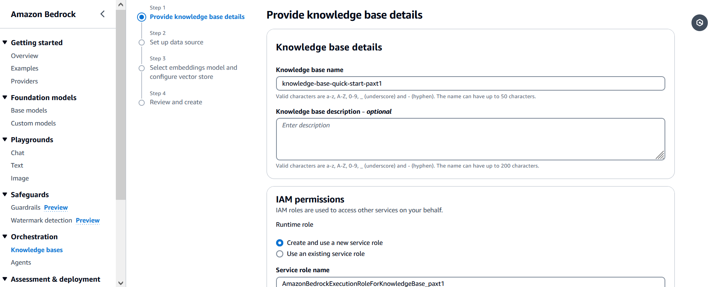
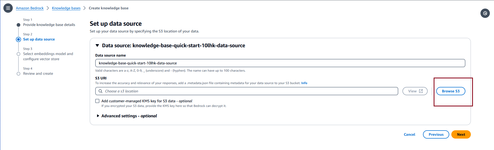
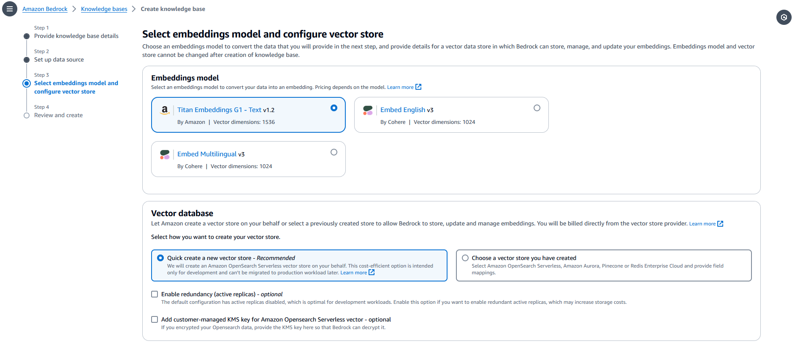
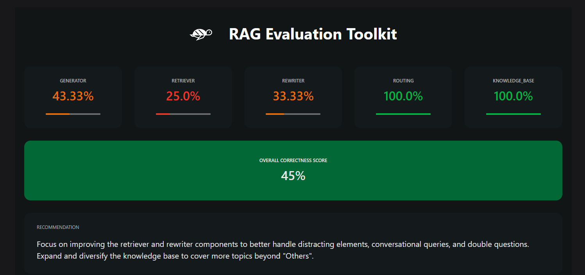

# Bedrock-RAG-PoC

This PoC leverages Amazon Bedrock and Claude 3 allowing users to ask questions against the documents contained within the knowledge Base, in this case AWS documentation. The application is built with a Retrieval-Augmented Generation (RAG) architecture.


# **Goal of this Repo:**

The goal of this repository is to demonstrate, in a simple yet effective manner, how to interact with our data using a (RAG) solution. This approach allows you to ask natural language questions and receive answers based on the knowledge base.

The architecture and flow of the sample application will be:



When a user interacts with the app, the flow is as follows:

1. The user makes a request to the streamlit app (app.py).
2. The app invokes the answer_query function from (chatbot.py) 
3. The chatbot issues a get contexts query to the Amazon Bedrock Knowledge base based on the user request. (chatbot.py)
4. The knowledge base returns search results related to the relevant documents from the ingested data. (chatbot.py)
5. The app sends the user request and along with the data retrieved from the Amazon Bedrock Knowlegebase as context in the Claude prompt. (chatbot.py)
6. Claude returns a succinct response to the user request based on the retrieved data. (chatbot.py)
7. The output is send as result from answer_query into app.py (chatbot.py) 
8. The response from Claude is displayed in the streamlit app to the user. (app.py)

# How to use this Repo:

## Prerequisites:

1. Amazon Bedrock Access and CLI Credentials.
2. Appropriate permissions to configure Amazon Bedrock Knowledge bases.
3. Ensure Python 3.10 installed on your machine, it can be downloaded [here](https://www.python.org/downloads/release/python-3100/).

## Step 1:

The first step of utilizing this repo is performing a git clone of the repository.

```
git clone https://github.com/Edgarciah/AWS-RAG.git
```

After cloning the repo onto your local machine, open it up in your favorite code editor.The file structure of this repo is broken into 4 key files,
the app.py file, the chatbot.py file, the .env file and the requirements.txt.
The app.py file houses the frontend application (a streamlit app).
The chatbot.py file houses the logic for taking a user question and letting Claude generate a response, this includes both the Knowledge base get contexts calls and Amazon Bedrock LLM API invocation.
The .env file contains the credentials needed to deploy the solution such as AWS profile ID and Knowledge Base ID.
The requirements.txt file contains all necessary dependencies for this sample application to work.

## Step 2:

Set up a python virtual environment in the root directory of the repository and ensure that you are using Python 3.10. This can be done by running the following commands:

```
pip install virtualenv
python3.10 -m venv venv
```

The virtual environment will be extremely useful when you begin installing the requirements. If you need more clarification on the creation of the virtual environment please refer to this [blog](https://www.freecodecamp.org/news/how-to-setup-virtual-environments-in-python/).
After the virtual environment is created, ensure that it is activated, following the activation steps of the virtual environment tool you are using. Likely:

```
cd venv
cd bin
source activate
cd ../../
```

After your virtual environment has been created and activated, you can install all the requirements found in the requirements.txt file by running this command in the root of this repos directory in your terminal:

```
pip install -r requirements.txt
```

## Step 3:

Now that we have successfully cloned the repo, created and activated the virtual environment and installed the necessary dependencies, it is time for us to create Amazon Bedrock Knowledge base.

To create our Amazon Bedrock Knowledge base we will:

1. Go to the Amazon Bedrock Service homepage within the AWS console and on the left-hand side we will select "Knowledge bases" under the "Orchestration" drop down 

2. We will then click on "Create knowledge base" 

3. In the Knowledge base details section, you can optionally change the default name and provide a description for your knowledge base.In the IAM permissions section, choose an AWS Identity and Access Management (IAM) role that provides Amazon Bedrock permission to access other AWS services. You can let Amazon Bedrock create the service role or choose a custom role that you have created. Optionally, add tags to your knowledge base. Select Next. 

4. On the Set up data source page, provide the information for the data source to use for the knowledge base: Optionally, change the default Data source name. Provide the S3 URI of the object containing the files for the data source that you prepared. Select Next. 

5. In the Embeddings model section, choose a supported embeddings model to convert your data into vector embeddings for the knowledge base. In the Vector database section, choose Quick create a new vector store and select Next 

6. On the Review and create page, check the configuration and details of your knowledge base. Choose Edit in any section that you need to modify. When you are satisfied, select Create knowledge base.


## Step 4:

Now that the requirements have been successfully installed in your virtual environment, your Bedrock Knowledge base is created, we can now begin configuring environment variables.
You will first need to edit the .env file in the root of this repo. Within the .env file you will need to configure the .env to contain:

```
profile_name=<AWS_CLI_PROFILE_NAME>
bedrock_region=<AWS_REGION>
knowledge_base_id=<Knowledge Base Id of the the Knowledge Base we created in the previous step>
```

Please ensure that your AWS CLI Profile has access to Amazon Bedrock!


Since this repository is configured to leverage Claude 3, the prompt payload is structured in a different format. If you wanted to leverage other Amazon Bedrock models you can replace the answer_query() function in the chatbot.py to look like:


## Step 7:

As soon as you have successfully configured the environment variables and the required code changes, the app it's ready to go.
To start up the application with its basic frontend you simply need to run the following command in your terminal while in the src folder of the repositories directory:

```
streamlit run app.py
```

As soon as the application is up and running in your browser of choice you can begin asking natural language questions against the data sources that you configured with Knowledge bases.

## Verify notebook

The purpose of the verify notebook is to demonstrate one way to evaluate our RAG project. Currently, it processes a single document, but it should eventually handle all the data used in the knowledge base. The notebook generates a set of questions, sends them to our RAG solution, and then compares the responses. As example it retrieves the following metrics:



This approach allows us to gain a comprehensive overview of our solution's performance and take appropriate actions to improve it.

